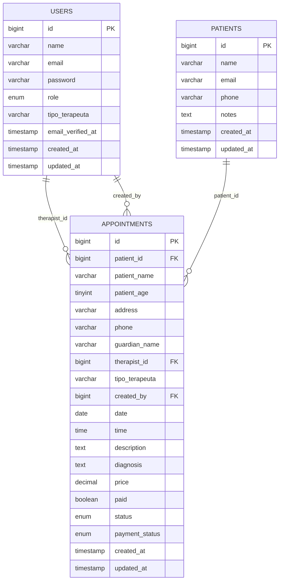

# 1. Descripción General del Sistema

## Objetivo del sistema

El sistema gestiona citas terapéuticas para la Fundación Corazón Down. Permite autenticar usuarios por rol, registrar pacientes, agendar citas, asignar terapeutas, consultar agendas, actualizar estados de atención, controlar pagos y visualizar indicadores operativos por perfil.

## Tecnologías utilizadas

| Capa | Tecnología |
| ---- | ---------- |
| Backend | PHP 8.3, Laravel 13 |
| Frontend | Blade, HTML, CSS, JavaScript |
| Build frontend | Vite, Laravel Vite Plugin, Tailwind CSS disponible |
| Autenticación | Autenticación nativa de Laravel mediante sesiones |
| Base de datos | Migraciones Eloquent compatibles con MySQL/MariaDB, PostgreSQL o SQLite según configuración |
| ORM | Eloquent |
| Pruebas | PHPUnit |
| Herramientas de desarrollo | Composer, NPM, Laravel Pint, Laravel Pail, Concurrently |

## Arquitectura general

La aplicación sigue una arquitectura MVC propia de Laravel:

| Componente | Responsabilidad |
| ---------- | --------------- |
| Rutas | Definen accesos públicos, autenticación y módulos protegidos por rol en `routes/web.php`. |
| Controladores | Orquestan reglas de negocio, validación, consultas y redirecciones. Los controladores principales son `AppointmentController`, `PatientController`, `AuthController` y `RegisterController`. |
| Modelos | Representan entidades de negocio y relaciones: `User`, `Patient` y `Appointment`. |
| Middleware | `RoleMiddleware` valida que el usuario autenticado tenga uno de los roles permitidos para cada grupo de rutas. |
| Vistas | Blade renderiza dashboards, listados, formularios y detalle de pacientes/citas. |
| Base de datos | Migraciones crean usuarios, pacientes, citas, sesiones, colas, caché y recuperación de contraseña. |

El flujo de acceso inicia en `/`. Si el usuario está autenticado, el sistema lo redirige a su dashboard según rol. Si no está autenticado, lo redirige a `/login`.

# 2. Roles y Permisos

## Administrador

### Descripción

Rol con mayor nivel de control operativo. Puede consultar indicadores globales, ver pacientes, editar pacientes, administrar citas existentes, cambiar estados de cita, actualizar pagos y eliminar citas. El administrador por defecto se crea mediante seeder; el formulario público de registro no permite crear administradores.

### Acciones Permitidas

| Módulo | Acción | Descripción |
| ------ | ------ | ----------- |
| Dashboard | Ver | Consultar métricas globales de citas, terapeutas, recepcionistas y agenda del día. |
| Pacientes | Ver | Consultar listado y detalle de pacientes. |
| Pacientes | Editar | Modificar nombre, teléfono, correo y notas del paciente. |
| Pacientes | Buscar | Buscar pacientes para consulta o selección. |
| Citas | Ver | Consultar todas las citas del sistema con filtros. |
| Citas | Editar | Modificar datos de una cita existente. |
| Citas | Completar | Marcar citas como completadas. |
| Citas | Cancelar | Marcar citas como canceladas. |
| Citas | Eliminar | Eliminar citas registradas. |
| Pagos | Actualizar | Cambiar el estado de pago entre pagado y no pagado. |
| Autenticación | Cerrar sesión | Finalizar sesión activa. |

### Restricciones

No tiene ruta implementada para crear citas desde el módulo de administrador. No tiene módulo CRUD implementado para administrar usuarios desde interfaz. No puede registrar administradores desde el formulario público. La creación de administradores depende del seeder o de una acción manual en base de datos/código.

## Recepcionista

### Descripción

Rol operativo encargado de registrar pacientes indirectamente durante el agendamiento, consultar pacientes, crear citas, modificar citas, cancelar citas y registrar pagos.

### Acciones Permitidas

| Módulo | Acción | Descripción |
| ------ | ------ | ----------- |
| Dashboard | Ver | Consultar citas del día, pendientes, completadas, canceladas y próximas citas. |
| Pacientes | Ver | Consultar listado y detalle de pacientes. |
| Pacientes | Crear | Registrar un nuevo paciente durante el flujo de creación de cita. |
| Pacientes | Editar | Modificar nombre, teléfono, correo y notas del paciente. |
| Pacientes | Buscar | Buscar pacientes existentes para agendar una cita. |
| Citas | Crear | Agendar nuevas citas para pacientes existentes o nuevos. |
| Citas | Ver | Consultar todas las citas con filtros. |
| Citas | Editar | Modificar datos de citas existentes. |
| Citas | Cancelar | Marcar citas como canceladas. |
| Pagos | Actualizar | Cambiar el estado de pago entre pagado y no pagado. |
| Autenticación | Cerrar sesión | Finalizar sesión activa. |

### Restricciones

No puede eliminar citas. No puede marcar citas como completadas desde sus rutas. No puede ver ni modificar usuarios. No puede acceder a dashboards o rutas de administrador y terapeuta. No tiene acceso a pacientes asignados como terapeuta porque su consulta es global.

## Terapeuta

### Descripción

Rol clínico encargado de consultar su agenda y los pacientes asociados a sus citas. Su acceso está limitado a las citas donde aparece como terapeuta asignado y, para pacientes, al tipo de terapia correspondiente.

### Acciones Permitidas

| Módulo | Acción | Descripción |
| ------ | ------ | ----------- |
| Dashboard | Ver | Consultar métricas propias: citas de hoy, pendientes, completadas y total asignado. |
| Pacientes | Ver | Consultar pacientes asociados a sus citas y de su tipo de terapia. |
| Citas | Ver | Consultar únicamente sus citas asignadas. |
| Citas | Completar | Marcar como completadas las citas donde es terapeuta asignado. |
| Autenticación | Cerrar sesión | Finalizar sesión activa. |

### Restricciones

No puede crear, editar, cancelar ni eliminar citas. No puede actualizar pagos. No puede editar pacientes. No puede ver pacientes sin citas asociadas a su usuario y tipo de terapeuta. No puede acceder a rutas de administrador o recepcionista.

# 3. Mapa de Navegación

## Público / Invitado

* Login (`/login`)
* Registro (`/register`)
* Inicio (`/`, redirige a login o dashboard según sesión)

## Administrador

* Dashboard de administrador (`/admin/dashboard`)
* Pacientes (`/patients`)
* Detalle de paciente (`/patients/{patient}`)
* Editar paciente (`/patients/{patient}/edit`)
* Búsqueda de pacientes (`/patients/search`)
* Citas de administrador (`/admin/citas`)
* Editar cita de administrador (`/admin/citas/{appointment}/edit`)
* Cerrar sesión (`/logout`)

## Recepcionista

* Dashboard de recepcionista (`/recepcionista/dashboard`)
* Pacientes (`/patients`)
* Detalle de paciente (`/patients/{patient}`)
* Editar paciente (`/patients/{patient}/edit`)
* Búsqueda de pacientes (`/patients/search`)
* Citas de recepcionista (`/recepcionista/citas`)
* Crear cita (`/recepcionista/citas/create`)
* Editar cita (`/recepcionista/citas/{appointment}/edit`)
* Cerrar sesión (`/logout`)

## Terapeuta

* Dashboard de terapeuta (`/terapeuta/dashboard`)
* Pacientes asignados (`/patients`)
* Detalle de paciente asignado (`/patients/{patient}`)
* Agenda / citas asignadas (`/terapeuta/citas`)
* Cerrar sesión (`/logout`)

# 4. Estructura de Base de Datos

## users

### Descripción

Almacena los usuarios autenticables del sistema y su rol operativo.

### Campos

| Campo | Tipo | Nulo | Llave | Descripción |
| ----- | ---- | ---- | ----- | ----------- |
| id | bigint unsigned | No | PK | Identificador del usuario. |
| name | varchar(255) | No | | Nombre del usuario. |
| email | varchar(255) | No | UNIQUE | Correo electrónico usado para iniciar sesión. |
| email_verified_at | timestamp | Sí | | Fecha de verificación del correo. |
| password | varchar(255) | No | | Contraseña cifrada. |
| role | enum | No | | Rol: administrador, recepcionista o terapeuta. |
| tipo_terapeuta | varchar(255) | Sí | | Especialidad del terapeuta: psicología, terapia física, terapia ocupacional, lectoescritura o lenguaje. |
| remember_token | varchar(100) | Sí | | Token de sesión persistente. |
| created_at | timestamp | Sí | | Fecha de creación. |
| updated_at | timestamp | Sí | | Fecha de actualización. |

### Relaciones

| Relación | Tabla Destino | Tipo |
| -------- | ------------- | ---- |
| id -> appointments.therapist_id | appointments | hasMany |
| id -> appointments.created_by | appointments | hasMany |

## patients

### Descripción

Almacena el expediente administrativo básico del paciente.

### Campos

| Campo | Tipo | Nulo | Llave | Descripción |
| ----- | ---- | ---- | ----- | ----------- |
| id | bigint unsigned | No | PK | Identificador del paciente. |
| name | varchar(255) | No | | Nombre del paciente. |
| email | varchar(255) | Sí | | Correo del paciente o tutor. |
| phone | varchar(255) | Sí | | Teléfono del paciente o contacto. |
| notes | text | Sí | | Notas generales. |
| created_at | timestamp | Sí | | Fecha de creación. |
| updated_at | timestamp | Sí | | Fecha de actualización. |

### Relaciones

| Relación | Tabla Destino | Tipo |
| -------- | ------------- | ---- |
| id -> appointments.patient_id | appointments | hasMany |

## appointments

### Descripción

Registra citas terapéuticas, paciente asociado, terapeuta asignado, datos de contacto, estado clínico-operativo y control de pago.

### Campos

| Campo | Tipo | Nulo | Llave | Descripción |
| ----- | ---- | ---- | ----- | ----------- |
| id | bigint unsigned | No | PK | Identificador de la cita. |
| patient_id | bigint unsigned | Sí | FK | Paciente asociado. Si el paciente se elimina, queda nulo. |
| patient_name | varchar(255) | No | | Nombre del paciente copiado para referencia histórica. |
| patient_age | unsigned tinyint | Sí | | Edad del paciente al registrar la cita. |
| address | varchar(255) | Sí | | Dirección del paciente. |
| phone | varchar(30) | Sí | | Teléfono de contacto para la cita. |
| guardian_name | varchar(255) | Sí | | Nombre del tutor o responsable. |
| therapist_id | bigint unsigned | No | FK | Usuario terapeuta asignado. |
| tipo_terapeuta | varchar(255) | Sí | | Especialidad del terapeuta al momento de la cita. |
| created_by | bigint unsigned | No | FK | Usuario que creó la cita. |
| date | date | No | | Fecha de la cita. |
| time | time | No | | Hora de la cita. |
| description | text | Sí | | Motivo, observaciones o descripción inicial. |
| diagnosis | text | Sí | | Diagnóstico o registro clínico asociado a la cita. |
| price | decimal(10,2) | No | | Importe de la cita. |
| paid | boolean | No | | Indicador booleano de pago. |
| status | enum | No | | Estado: pendiente, completada o cancelada. |
| payment_status | enum | No | | Estado de pago: no_pagado o pagado. |
| created_at | timestamp | Sí | | Fecha de creación. |
| updated_at | timestamp | Sí | | Fecha de actualización. |

### Relaciones

| Relación | Tabla Destino | Tipo |
| -------- | ------------- | ---- |
| patient_id | patients | belongsTo |
| therapist_id | users | belongsTo |
| created_by | users | belongsTo |

## password_reset_tokens

### Descripción

Tabla técnica de Laravel para tokens de restablecimiento de contraseña.

### Campos

| Campo | Tipo | Nulo | Llave | Descripción |
| ----- | ---- | ---- | ----- | ----------- |
| email | varchar(255) | No | PK | Correo asociado al token. |
| token | varchar(255) | No | | Token de recuperación. |
| created_at | timestamp | Sí | | Fecha de creación del token. |

### Relaciones

| Relación | Tabla Destino | Tipo |
| -------- | ------------- | ---- |
| email | users.email | Referencia lógica |

## sessions

### Descripción

Tabla técnica para sesiones de usuario cuando la aplicación usa driver de sesión basado en base de datos.

### Campos

| Campo | Tipo | Nulo | Llave | Descripción |
| ----- | ---- | ---- | ----- | ----------- |
| id | varchar(255) | No | PK | Identificador de sesión. |
| user_id | bigint unsigned | Sí | INDEX | Usuario autenticado asociado. |
| ip_address | varchar(45) | Sí | | Dirección IP. |
| user_agent | text | Sí | | Navegador o cliente. |
| payload | longtext | No | | Datos serializados de la sesión. |
| last_activity | integer | No | INDEX | Última actividad en timestamp Unix. |

### Relaciones

| Relación | Tabla Destino | Tipo |
| -------- | ------------- | ---- |
| user_id | users | Referencia lógica |

## cache

### Descripción

Tabla técnica para almacenar entradas de caché.

### Campos

| Campo | Tipo | Nulo | Llave | Descripción |
| ----- | ---- | ---- | ----- | ----------- |
| key | varchar(255) | No | PK | Clave de caché. |
| value | mediumtext | No | | Valor almacenado. |
| expiration | bigint | No | INDEX | Fecha de expiración en timestamp Unix. |

### Relaciones

| Relación | Tabla Destino | Tipo |
| -------- | ------------- | ---- |
| Ninguna | N/A | N/A |

## cache_locks

### Descripción

Tabla técnica para bloqueos atómicos de caché.

### Campos

| Campo | Tipo | Nulo | Llave | Descripción |
| ----- | ---- | ---- | ----- | ----------- |
| key | varchar(255) | No | PK | Clave del bloqueo. |
| owner | varchar(255) | No | | Propietario del bloqueo. |
| expiration | bigint | No | INDEX | Fecha de expiración en timestamp Unix. |

### Relaciones

| Relación | Tabla Destino | Tipo |
| -------- | ------------- | ---- |
| Ninguna | N/A | N/A |

## jobs

### Descripción

Tabla técnica para trabajos en cola pendientes de ejecución.

### Campos

| Campo | Tipo | Nulo | Llave | Descripción |
| ----- | ---- | ---- | ----- | ----------- |
| id | bigint unsigned | No | PK | Identificador del trabajo. |
| queue | varchar(255) | No | INDEX | Nombre de la cola. |
| payload | longtext | No | | Payload serializado del trabajo. |
| attempts | unsigned tinyint | No | | Número de intentos. |
| reserved_at | unsigned integer | Sí | | Momento en que fue reservado. |
| available_at | unsigned integer | No | | Momento desde el que está disponible. |
| created_at | unsigned integer | No | | Fecha de creación en timestamp Unix. |

### Relaciones

| Relación | Tabla Destino | Tipo |
| -------- | ------------- | ---- |
| Ninguna | N/A | N/A |

## job_batches

### Descripción

Tabla técnica para lotes de trabajos en cola.

### Campos

| Campo | Tipo | Nulo | Llave | Descripción |
| ----- | ---- | ---- | ----- | ----------- |
| id | varchar(255) | No | PK | Identificador del lote. |
| name | varchar(255) | No | | Nombre del lote. |
| total_jobs | integer | No | | Total de trabajos. |
| pending_jobs | integer | No | | Trabajos pendientes. |
| failed_jobs | integer | No | | Trabajos fallidos. |
| failed_job_ids | longtext | No | | Identificadores de trabajos fallidos. |
| options | mediumtext | Sí | | Opciones del lote. |
| cancelled_at | integer | Sí | | Fecha de cancelación en timestamp Unix. |
| created_at | integer | No | | Fecha de creación en timestamp Unix. |
| finished_at | integer | Sí | | Fecha de finalización en timestamp Unix. |

### Relaciones

| Relación | Tabla Destino | Tipo |
| -------- | ------------- | ---- |
| Ninguna | N/A | N/A |

## failed_jobs

### Descripción

Tabla técnica para registrar trabajos en cola que fallaron.

### Campos

| Campo | Tipo | Nulo | Llave | Descripción |
| ----- | ---- | ---- | ----- | ----------- |
| id | bigint unsigned | No | PK | Identificador del fallo. |
| uuid | varchar(255) | No | UNIQUE | UUID del trabajo fallido. |
| connection | text | No | | Conexión de cola. |
| queue | text | No | | Cola usada. |
| payload | longtext | No | | Payload serializado. |
| exception | longtext | No | | Excepción producida. |
| failed_at | timestamp | No | | Fecha del fallo. |

### Relaciones

| Relación | Tabla Destino | Tipo |
| -------- | ------------- | ---- |
| Ninguna | N/A | N/A |

# 5. Diagrama de Relaciones

# 6. Matriz Completa de Permisos

| Módulo | Administrador | Terapeuta | Recepcionista |
| ------ | ------------- | --------- | ------------- |
| Autenticación | R | R | R |
| Registro de usuarios | No | No | No |
| Dashboard | R | R propio | R |
| Usuarios | R parcial | No | No |
| Pacientes | RU | R asignado | CRU |
| Búsqueda de pacientes | R | No | R |
| Citas | RUD | RU propio | CRU |
| Estado de cita | RUD | RU propio | RU |
| Pagos | RU | No | RU |
| Reportes / métricas | R | R propio | R operativo |
| Configuración | No | No | No |

Leyenda:

* C = Create
* R = Read
* U = Update
* D = Delete
* Propio = limitado a registros asignados al usuario autenticado
* Asignado = limitado a pacientes asociados a citas del terapeuta y a su tipo de terapia

# 7. Flujo Operativo

## Registro de paciente

1. La recepcionista entra al módulo de creación de cita.
2. Selecciona si el paciente ya existe o si se registrará uno nuevo.
3. Si el paciente existe, lo busca y selecciona desde el catálogo de pacientes.
4. Si el paciente es nuevo, captura nombre, teléfono, correo, notas, edad, dirección y tutor/responsable.
5. El sistema valida duplicados por correo, teléfono o combinación de nombre y teléfono.
6. El sistema crea el registro en `patients`.
7. El paciente queda disponible para futuras citas y consultas.

## Agendamiento de cita

1. La recepcionista abre el formulario de nueva cita.
2. Selecciona paciente existente o registra paciente nuevo.
3. Selecciona terapeuta.
4. El sistema obtiene el tipo de terapeuta desde el usuario asignado y lo copia en la cita.
5. Captura fecha, hora, descripción, precio y estado de pago.
6. El sistema valida que la fecha sea igual o posterior al día actual.
7. El sistema crea la cita con estado `pendiente`.
8. La cita queda visible en la agenda de recepcionista, administrador y terapeuta asignado.

## Atención terapéutica

1. El terapeuta inicia sesión.
2. El sistema lo redirige a su dashboard.
3. El terapeuta consulta sus citas del día o su agenda completa.
4. El sistema muestra únicamente citas donde `therapist_id` coincide con el usuario autenticado.
5. El terapeuta atiende al paciente según la cita programada.
6. Al finalizar, puede marcar la cita como `completada`.

## Registro de evolución

1. El sistema dispone del campo `diagnosis` en la tabla `appointments`.
2. La actualización del campo `diagnosis` está implementada en las rutas de edición de citas de administrador y recepcionista.
3. El registro queda asociado a la cita y al paciente.
4. En el detalle del paciente se consulta el historial de citas ordenado por fecha y hora descendente.
5. El terapeuta puede consultar el historial del paciente únicamente si está asociado a sus citas y tipo de terapia.

## Generación de reportes

1. El sistema genera métricas operativas desde los dashboards.
2. El administrador consulta totales globales: citas totales, citas de hoy, pendientes, completadas, canceladas, terapeutas y recepcionistas.
3. La recepcionista consulta métricas de operación diaria y próximas citas.
4. El terapeuta consulta métricas personales: citas de hoy, pendientes, completadas y total asignado.
5. Los listados de citas permiten filtrar por búsqueda, fecha, estado de cita y estado de pago.
6. Los reportes actuales son vistas operativas en pantalla; no hay exportación documental implementada en el código revisado.

# 8. Resumen Ejecutivo

| Métrica | Valor |
| ------- | ----- |
| Número total de tablas | 10 |
| Número total de roles | 3 |
| Número total de módulos | 8 |
| Número total de páginas | 14 páginas/rutas visuales principales |
| Principales relaciones del sistema | Usuarios crean citas; usuarios terapeutas atienden citas; pacientes tienen muchas citas. |

| Elemento | Detalle |
| -------- | ------- |
| Roles | Administrador, Recepcionista, Terapeuta |
| Módulos | Autenticación, Registro, Dashboard, Pacientes, Citas, Pagos, Reportes/Métricas, Sesiones |
| Tablas de negocio | users, patients, appointments |
| Tablas técnicas | password_reset_tokens, sessions, cache, cache_locks, jobs, job_batches, failed_jobs |
| Control de acceso | Middleware `role` aplicado por grupos de rutas |
| Restricción clínica principal | El terapeuta solo consulta citas propias y pacientes asociados a su tipo de terapia |
| Restricción administrativa principal | No existe CRUD completo de usuarios ni creación de citas desde el módulo administrador |
